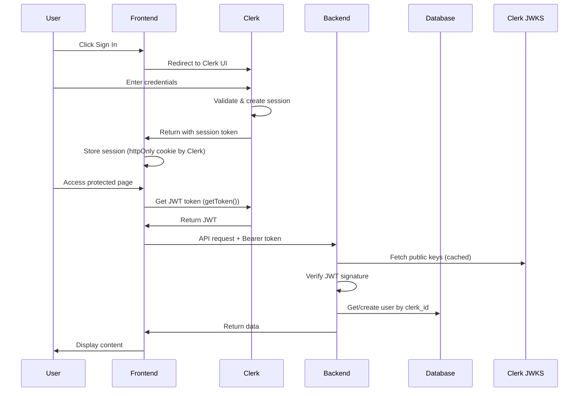

# LitXplore Authentication & Authorization Documentation

This document provides a comprehensive overview of the authentication and authorization system implemented in LitXplore, including architecture, security measures, and production deployment requirements.

## Table of Contents

1. [Architecture Overview](#architecture-overview)
2. [Authentication Flow](#authentication-flow)
3. [Frontend Authentication](#frontend-authentication)
4. [Backend Authentication](#backend-authentication)
5. [Security Features](#security-features)
6. [Authorization & Access Control](#authorization--access-control)
7. [Production Deployment Checklist](#production-deployment-checklist)
8. [Clerk Dashboard Configuration](#clerk-dashboard-configuration)
9. [Environment Variables Reference](#environment-variables-reference)
10. [Troubleshooting](#troubleshooting)

---

## Architecture Overview

LitXplore uses **Clerk** for authentication, implementing a modern, secure authentication architecture:

```
┌─────────────────┐     ┌─────────────────┐     ┌─────────────────┐
│                 │     │                 │     │                 │
│   Frontend      │────▶│     Clerk       │     │   Backend       │
│   (Next.js)     │     │   (Auth SaaS)   │     │   (FastAPI)     │
│                 │◀────│                 │     │                 │
└────────┬────────┘     └────────┬────────┘     └────────▲────────┘
         │                       │                       │
         │                       │                       │
         │    ┌──────────────────┼───────────────────────┤
         │    │                  │                       │
         │    │           JWT Token (Bearer)             │
         │    │                  │                       │
         └────┼──────────────────┼───────────────────────┘
              │                  │
              │     ┌────────────▼────────────┐
              │     │                         │
              └────▶│   JWKS Verification     │
                    │   (Public Key from      │
                    │   Clerk's JWKS endpoint)│
                    │                         │
                    └─────────────────────────┘
```

### Key Components

| Component | Technology | Role |
|-----------|-----------|------|
| Identity Provider | Clerk | Manages user accounts, sessions, MFA, OAuth |
| Frontend Auth | `@clerk/nextjs` | Handles sign-in/sign-up UI, session management |
| Backend Auth | Custom JWT verification | Validates Clerk tokens, manages user records |
| User Sync | Webhooks | Syncs user data from Clerk to local database |

---

## Authentication Flow

### 1. User Sign-In Flow



### 2. Token Verification Flow (Backend)

1. **Extract Token**: Get Bearer token from `Authorization` header
2. **Parse Header**: Extract `kid` (Key ID) from JWT header
3. **Fetch JWKS**: Get public keys from Clerk's JWKS endpoint (with caching)
4. **Key Rotation Handling**: If key not found, refresh JWKS and retry
5. **Verify Signature**: Validate JWT signature using RS256
6. **Validate Claims**: Check `iss`, `exp`, `iat`, `sub`, and optionally `azp`
7. **Sync User**: Get or create user in local database by `clerk_id`
8. **Return User**: Provide authenticated user object to endpoint

---

## Frontend Authentication

### Provider Setup

The app is wrapped with `ClerkProvider` in the root layout:

```tsx
// frontend/src/app/layout.tsx
<ClerkProvider
  appearance={{
    variables: {
      colorPrimary: "#f59e0b",
      colorBackground: "#09090b",
    },
  }}
>
  {children}
</ClerkProvider>
```

### Route Protection (Middleware)

Next.js middleware protects routes at the edge:

```typescript
// frontend/src/middleware.ts
import { clerkMiddleware, createRouteMatcher } from "@clerk/nextjs/server";

const isPublicRoute = createRouteMatcher([
  "/",
  "/search",
  "/sign-in(.*)",
  "/sign-up(.*)",
]);

export default clerkMiddleware(async (auth, request) => {
  if (!isPublicRoute(request)) {
    await auth.protect(); // Redirects to sign-in if not authenticated
  }
});
```

### Public vs Protected Routes

| Route | Access | Description |
|-------|--------|-------------|
| `/` | Public | Landing page |
| `/search` | Public | Paper search |
| `/sign-in/*` | Public | Authentication pages |
| `/sign-up/*` | Public | Registration pages |
| `/review` | Protected | Generate literature review |
| `/history` | Protected | View saved reviews |
| `/papers/*` | Protected | Paper analysis & chat |

### Token Attachment to API Requests

Tokens are automatically attached to API requests via Axios interceptor:

```typescript
// frontend/src/lib/api/axios-instance.ts
axiosInstance.interceptors.request.use(async (config) => {
  if (tokenGetter) {
    const token = await tokenGetter(); // Gets token from Clerk
    if (token) {
      config.headers.Authorization = `Bearer ${token}`;
    }
  }
  return config;
});

// Token getter is set in QueryProvider using Clerk's useAuth hook
setTokenGetter(getToken);
```

---

## Backend Authentication

### JWT Verification

The backend manually verifies Clerk JWTs using their public JWKS:

```python
# backend/app/core/auth.py

async def get_current_user(
    credentials: Optional[HTTPAuthorizationCredentials] = Depends(security),
    db: Session = Depends(get_db)
) -> User:
    """
    FastAPI dependency that validates Clerk JWT and returns authenticated user.
    
    Security features:
    - WWW-Authenticate header on 401 responses
    - JWKS key rotation handling with automatic refresh
    - Authorized party (azp) verification for frontend origin
    - Generic error messages to clients, detailed logs server-side
    """
```

### Key Features

1. **Async JWKS Fetching**: Uses `httpx` for non-blocking HTTP requests
2. **JWKS Caching**: 1-hour cache to reduce latency and Clerk API calls
3. **Key Rotation Handling**: Automatically refetches JWKS if key not found
4. **Generic Error Messages**: Detailed errors logged server-side only
5. **WWW-Authenticate Header**: Proper 401 responses per RFC 7235

### Protected Endpoints

All user-specific endpoints require authentication:

```python
@router.post("/generate-review")
async def generate_review(
    review_request: ReviewRequest,
    current_user: User = Depends(get_current_user),  # Auth required
    db: Session = Depends(get_db)
):
```

| Endpoint | Authentication | Description |
|----------|---------------|-------------|
| `GET /health` | None | Health check |
| `GET /papers/search` | None | Search papers |
| `GET /papers/{id}` | None | Get paper details |
| `POST /papers/upload` | Required | Upload PDF |
| `POST /review/generate-review` | Required | Generate review |
| `POST /review/save` | Required | Save review |
| `GET /review/history` | Required | Get user's reviews |
| `POST /analysis/{id}/analyze` | Required | Analyze paper |
| `POST /papers/{id}/chat` | Required | Chat with paper |
| `POST /documents/generate` | Required | Generate PDF/LaTeX |
| `POST /users/webhook/clerk` | Webhook signature | Clerk webhooks |

---

## Security Features

### 1. JWT Security

- **RS256 Algorithm**: Asymmetric cryptography - backend never sees private key
- **Issuer Validation**: Tokens must come from configured Clerk issuer
- **Expiration Validation**: Tokens must not be expired
- **Authorized Party (azp)**: Validates token was issued for your frontend

### 2. Webhook Security

```python
# Webhook signature verification using Svix
async def verify_clerk_webhook(request: Request, ...):
    # SECURITY: Webhook secret is REQUIRED in production
    if not settings.CLERK_WEBHOOK_SECRET:
        if settings.PRODUCTION or settings.ENV == "production":
            raise_internal_error("Webhook configuration error")
        # Development only: allow unverified webhooks with warning
```

### 3. Security Headers

The backend adds security headers to all responses:

```python
class SecurityHeadersMiddleware:
    async def dispatch(self, request, call_next):
        response = await call_next(request)
        response.headers["X-Content-Type-Options"] = "nosniff"
        response.headers["X-Frame-Options"] = "DENY"
        response.headers["X-XSS-Protection"] = "1; mode=block"
        response.headers["Referrer-Policy"] = "strict-origin-when-cross-origin"
        response.headers["Content-Security-Policy"] = "default-src 'none'"
        if settings.PRODUCTION:
            response.headers["Strict-Transport-Security"] = "max-age=31536000"
        return response
```

### 4. CORS Configuration

```python
# Production-appropriate CORS settings
allowed_methods = ["GET", "POST", "PUT", "DELETE", "OPTIONS", "PATCH"]
allowed_headers = ["Authorization", "Content-Type", "Accept", "Origin", ...]

app.add_middleware(
    CORSMiddleware,
    allow_origins=settings.CORS_ORIGINS,  # Strict allowlist
    allow_credentials=False,  # We use Bearer tokens, not cookies
    allow_methods=allowed_methods,
    allow_headers=allowed_headers,
)
```

### 5. Input Validation

- Paper ID validation to prevent injection attacks
- Maximum file size limits for uploads
- PDF header validation for uploaded files
- Request body validation with Pydantic models

---

## Authorization & Access Control

### User Isolation

Every user-specific query filters by user ID:

```python
# Users can only access their own reviews
reviews = db.query(Review).filter(
    Review.user_id == current_user.id
).all()
```

### Resource Ownership

```python
# Delete only if user owns the resource
review = db.query(Review).filter(
    Review.id == review_id,
    Review.user_id == current_user.id  # Ownership check
).first()
```

### Future: Role-Based Access Control

The system is prepared for role-based access:

```python
# In validate_token_claims (currently commented out)
if settings.REQUIRE_ROLES:
    user_roles = payload.get("roles", [])
    if not set(user_roles).intersection(set(settings.ALLOWED_ROLES)):
        raise_forbidden("User does not have required roles")
```

---

## Production Deployment Checklist

### Required Steps Before Going Live

#### 1. Environment Variables (Backend)

```bash
# MUST SET in production:
PRODUCTION=true
ENV=production

# Clerk configuration (get from Clerk Dashboard):
CLERK_ISSUER=https://your-production-domain.clerk.accounts.dev
CLERK_JWKS_URL=https://your-production-domain.clerk.accounts.dev/.well-known/jwks.json
CLERK_SECRET_KEY=sk_live_xxxxxxxxxx  # Use LIVE key, not test
CLERK_PUBLISHABLE_KEY=pk_live_xxxxxxxxxx
CLERK_WEBHOOK_SECRET=whsec_xxxxxxxxxx  # REQUIRED!

# Authorized parties (your frontend URLs):
CLERK_AUTHORIZED_PARTIES=["https://litxplore.com","https://www.litxplore.com"]

# CORS (your frontend URLs only):
CORS_ORIGINS=["https://litxplore.com","https://www.litxplore.com"]
```

#### 2. Environment Variables (Frontend)

```bash
# Next.js environment variables
NEXT_PUBLIC_CLERK_PUBLISHABLE_KEY=pk_live_xxxxxxxxxx
CLERK_SECRET_KEY=sk_live_xxxxxxxxxx

# Frontend API URL
NEXT_PUBLIC_API_URL=https://api.litxplore.com
```

#### 3. Clerk Dashboard Configuration

See [Clerk Dashboard Configuration](#clerk-dashboard-configuration) section.

#### 4. Security Checklist

- [ ] All secrets in environment variables, not code
- [ ] `PRODUCTION=true` set
- [ ] `CLERK_WEBHOOK_SECRET` configured
- [ ] `CLERK_AUTHORIZED_PARTIES` set to production frontend URLs
- [ ] `CORS_ORIGINS` restricted to production frontend URLs
- [ ] HTTPS enabled on all endpoints
- [ ] Database credentials are production credentials
- [ ] Rate limiting configured appropriately

---

## Clerk Dashboard Configuration

### Step-by-Step Setup

#### 1. Create Production Instance

1. Go to [Clerk Dashboard](https://dashboard.clerk.com)
2. Create a new instance for production (or switch existing to production mode)
3. Note your instance ID (the subdomain before `.clerk.accounts.dev`)

#### 2. Configure Authentication Methods

1. Go to **Configure → User & Authentication → Email, Phone, Username**
2. Enable/disable sign-in methods as needed:
   - Email address (recommended)
   - Phone number (optional)
   - Username (optional)

3. Go to **Configure → User & Authentication → Social Connections**
4. Enable OAuth providers if needed:
   - Google
   - GitHub
   - etc.

#### 3. Configure JWT Templates (Optional)

If you need custom claims in your JWTs:

1. Go to **Configure → JWT Templates**
2. Create a new template or edit the default
3. Add custom claims if needed (e.g., roles, organization)

#### 4. Set Up Webhooks

**CRITICAL for production!**

1. Go to **Configure → Webhooks**
2. Click **Add Endpoint**
3. Enter your endpoint URL: `https://api.litxplore.com/api/v1/users/webhook/clerk`
4. Select events to listen to:
   - `user.created`
   - `user.updated`
   - `user.deleted` (if you want to handle deletions)
5. Click **Create**
6. Copy the **Signing Secret** (starts with `whsec_`)
7. Set this as `CLERK_WEBHOOK_SECRET` in your backend environment

#### 5. Configure Domains (Custom Domain)

For production with a custom domain:

1. Go to **Configure → Domains**
2. Add your production frontend domain
3. Follow DNS configuration instructions
4. Update `CLERK_ISSUER` to use your custom domain if applicable

#### 6. Get API Keys

1. Go to **Configure → API Keys**
2. Copy the **Publishable key** (`pk_live_...`)
3. Copy the **Secret key** (`sk_live_...`)
4. **Never expose the secret key in frontend code**

#### 7. Configure Session Settings

1. Go to **Configure → Sessions**
2. Set session lifetime as appropriate:
   - Default: 7 days
   - Adjust based on your security requirements
3. Configure idle timeout if needed

---

## Environment Variables Reference

### Backend Variables

| Variable | Required | Description |
|----------|----------|-------------|
| `PRODUCTION` | Yes | Set to `true` in production |
| `ENV` | Yes | Set to `production` in production |
| `CLERK_ISSUER` | Yes | Clerk frontend API URL |
| `CLERK_FRONTEND_API` | Yes | Same as issuer |
| `CLERK_SECRET_KEY` | Yes | From Clerk Dashboard |
| `CLERK_PUBLISHABLE_KEY` | Yes | From Clerk Dashboard |
| `CLERK_JWKS_URL` | Yes | JWKS endpoint URL |
| `CLERK_WEBHOOK_SECRET` | **Prod** | Webhook signing secret |
| `CLERK_AUTHORIZED_PARTIES` | Recommended | Authorized frontend URLs |
| `JWT_ALGORITHM` | No | Default: RS256 |
| `CORS_ORIGINS` | Yes | Allowed frontend origins |

### Frontend Variables

| Variable | Required | Description |
|----------|----------|-------------|
| `NEXT_PUBLIC_CLERK_PUBLISHABLE_KEY` | Yes | Clerk publishable key |
| `CLERK_SECRET_KEY` | Yes | Clerk secret key (server-side) |
| `NEXT_PUBLIC_API_URL` | Yes | Backend API URL |

---

## Troubleshooting

### Common Issues

#### 1. "Authentication required" error

**Cause**: Token not being sent with request
**Solution**: 
- Check that `QueryProvider` is wrapping your app
- Verify `setTokenGetter` is being called
- Check browser Network tab for `Authorization` header

#### 2. "Invalid token" error

**Cause**: Token verification failed
**Solution**:
- Check `CLERK_ISSUER` matches your Clerk instance
- Verify `CLERK_JWKS_URL` is correct
- Check token hasn't expired (default 1 minute)

#### 3. "Key not found in JWKS" error

**Cause**: JWKS cache stale or key rotation
**Solution**: 
- This should auto-resolve (system retries with fresh JWKS)
- If persistent, check `CLERK_JWKS_URL` is accessible

#### 4. Webhook errors in production

**Cause**: Missing or invalid webhook secret
**Solution**:
- Verify `CLERK_WEBHOOK_SECRET` is set
- Check the secret matches Clerk Dashboard
- Verify webhook URL is accessible from internet

#### 5. CORS errors

**Cause**: Frontend origin not in allowed list
**Solution**:
- Add frontend URL to `CORS_ORIGINS`
- Include both with and without `www`
- Include all environment URLs (staging, preview)

### Debug Logging

Enable debug logging for authentication:

```python
import logging
logging.getLogger("app.core.auth").setLevel(logging.DEBUG)
```

### Testing Authentication

```bash
# Test token verification
curl -X GET "https://api.litxplore.com/api/v1/users/me" \
  -H "Authorization: Bearer YOUR_JWT_TOKEN"

# Expected success response:
# {"id": 1, "email": "user@example.com", ...}

# Expected failure response:
# {"status": "error", "error": {"code": "UNAUTHORIZED", "message": "Authentication required"}}
```

---

## Security Best Practices

1. **Never log tokens**: Token snippets in logs can aid attackers
2. **Use HTTPS everywhere**: Required for production
3. **Rotate secrets regularly**: Update Clerk keys periodically
4. **Monitor failed authentications**: Set up alerting for auth failures
5. **Keep dependencies updated**: Update Clerk SDK and JWT libraries
6. **Use short token lifetimes**: Default 1 minute is good
7. **Implement rate limiting**: Already configured with SlowAPI
8. **Validate all inputs**: Use Pydantic models for request validation

---

## Additional Resources

- [Clerk Documentation](https://clerk.com/docs)
- [Clerk Next.js Integration](https://clerk.com/docs/quickstarts/nextjs)
- [Clerk Webhooks](https://clerk.com/docs/integrations/webhooks)
- [JWT.io](https://jwt.io) - For debugging JWT tokens
- [OWASP Authentication Cheatsheet](https://cheatsheetseries.owasp.org/cheatsheets/Authentication_Cheat_Sheet.html)
